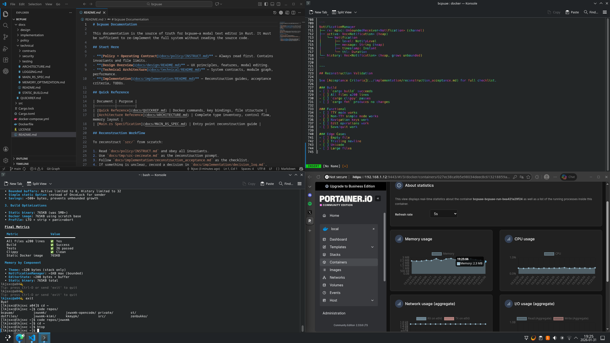

# bcpuae Documentation

This documentation is the source of truth for bcpuae—a modal text editor in Rust. It must be sufficient to re-implement the full system without reading the source code.

## Start Here

- **[Policy + Operating Contract](docs/policy/INSTRUCT.md)** — Always read first. Contains invariants and file limits.
- **[Design Overview](docs/design/README.md)** — UX principles, features, modal editing.
- **[Technical Architecture](docs/technical/README.md)** — System contracts, module graph, performance.
- **[Implementation](docs/implementation/README.md)** — Reconstruction guides, acceptance criteria, TODOs.

## Quick Reference

| Document | Purpose |
|----------|---------|
| [Quick Reference](docs/QUICKREF.md) | Docker commands, key bindings, file structure |
| [Architecture Reference](docs/ARCHITECTURE.md) | Complete type inventory, control flow, memory layout |
| [Main.rs Specification](docs/MAIN_RS_SPEC.md) | Entry point reconstruction guide |

## Reconstruction Workflow

To reconstruct `src/` from scratch:

1. Read `docs/policy/INSTRUCT.md` and obey all invariants.
2. Use `docs/tmp/src-recreate.md` as the reconstruction prompt.
3. Follow `docs/implementation/reconstruction_acceptance.md` as the checklist.
4. If something is unclear, record a decision in `docs/implementation/decision_log.md`.

## Sections

- **[Policy](docs/policy/README.md)** — Operating contract, constraints, quality bar
- **[Design](docs/design/README.md)** — Features, UX, modal editing mechanics
- **[Technical](docs/technical/README.md)** — Architecture, contracts, testing
- **[Implementation](docs/implementation/README.md)** — Reconstruction guides, TODOs
- **[Templates](docs/tmp/README.md)** — Agent prompts for reconstruction
